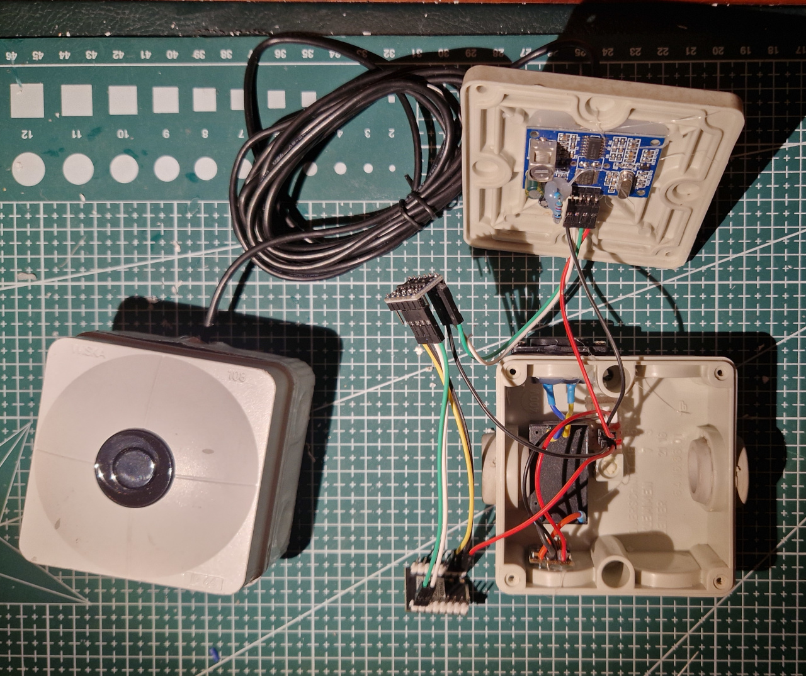
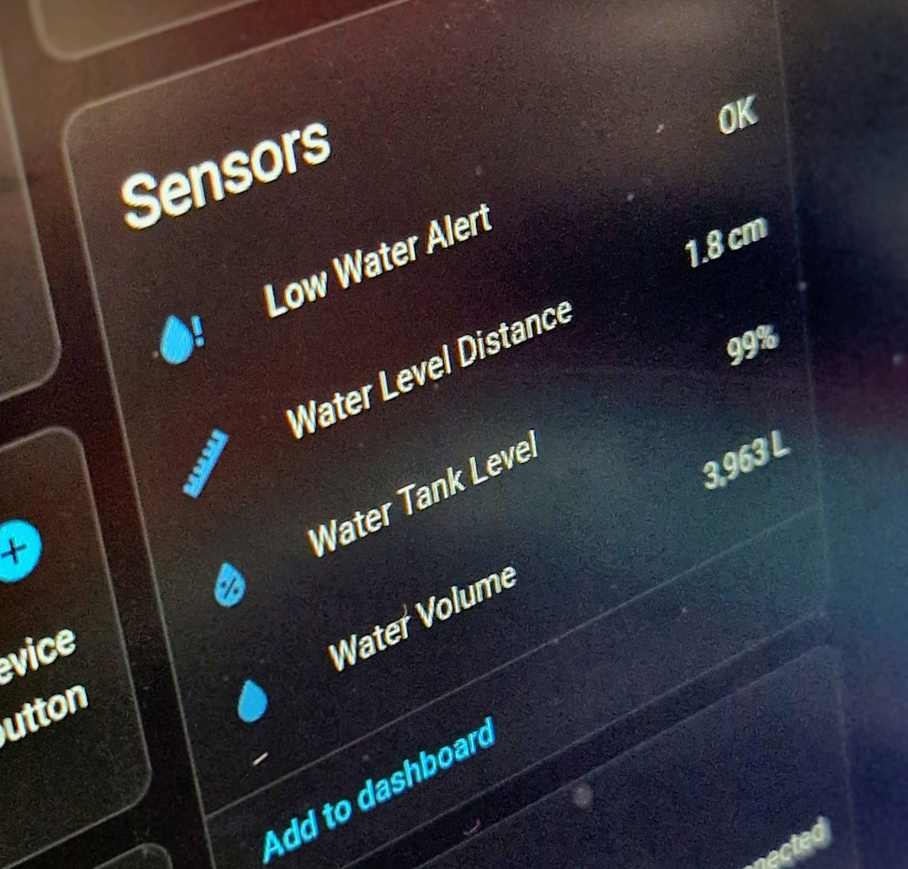
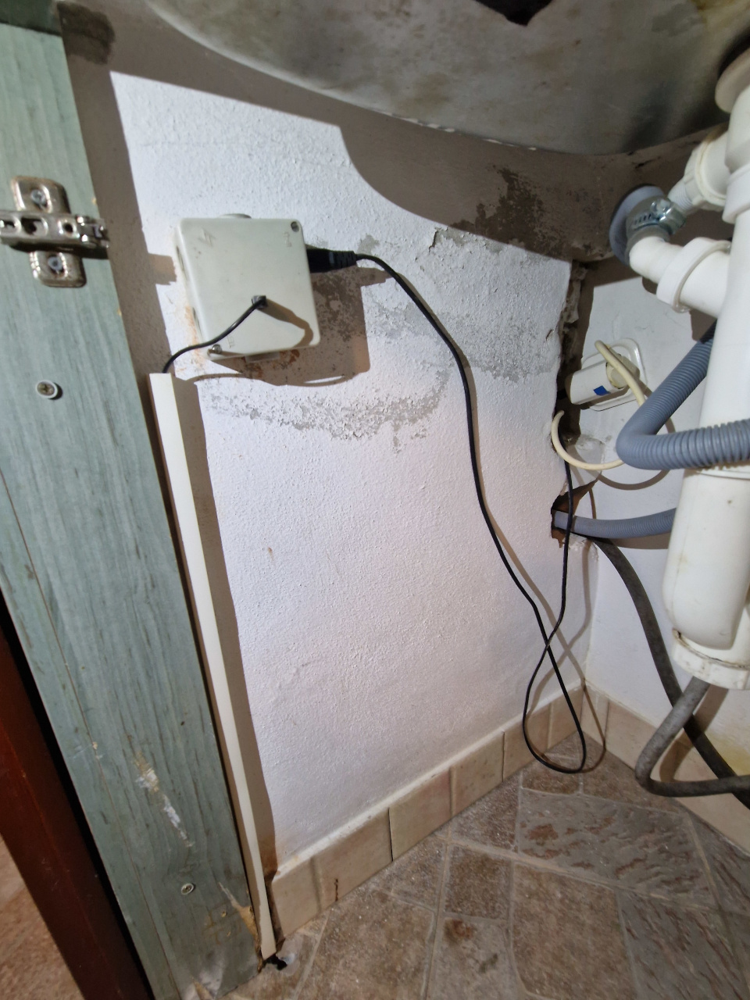
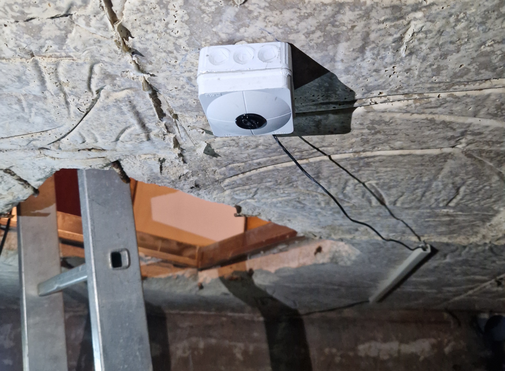

# 💧 ESPHome water level meter

Custom water level monitoring using ESPHome and ultrasonic sensors

## 📋 Project Overview

This project creates a Home Assistant-ready water level sensor using an **ESP32-C3 Super Mini** microcontroller and a **JSN-SR04T** waterproof ultrasonic sensor. The sensor operates in UART Mode 2 for reliable distance measurements and integrates seamlessly with ESPHome firmware.

### Key Features
- ⚡ **Accurate measurements** up to 5 meters range
- 🌊 **Waterproof sensor** suitable for outdoor tanks
- 🏠 **Home Assistant integration** via ESPHome
- 🔋 **Low power consumption** with ESP32-C3
- 📡 **Wireless connectivity** over WiFi

---

## 🛠️ Bill of Materials (BOM)

| Component | Purpose | Notes |
|-----------|---------|-------|
| **ESP32‑C3 Super Mini** | Main microcontroller | TENSTAR ROBOT or equivalent |
| **[JSN‑SR04T](docs/JSN‑SR04T.md)** | Ultrasonic distance sensor | Waterproof, 5V logic |
| **Logic Level Converter** | 5V ↔ 3.3V signal conversion | 4-channel bidirectional |
| **AQV258 PhotoMOS** | Power control relay | Optical isolation, 5V switching |
| **120kΩ Resistor** | Enable UART Mode 2 | Solder to R27 pad |
| **470kΩ Resistor** | PhotoMOS LED current limiting | Between GPIO10 and AQV258 |
| **Dupont Wires** | Connections | Male-to-female recommended |
| **5V Power Supply** | System power | USB to ESP32-C3 |

### 💡 Important Notes
> **Why the level shifter?** The JSN‑SR04T operates at 5V logic levels, while ESP32‑C3 GPIOs are 3.3V-only. The level shifter protects the ESP32 from voltage damage and ensures reliable communication.

**Detailed sensor information:** [JSN‑SR04T Technical Guide](docs/JSN‑SR04T.md)

---

## 🔧 Build Instructions

### Step-by-Step Process

1. **📱 Flash ESP32-C3 with ESPHome**
   - Use `./build.sh --check-only` to validate configuration syntax quickly (3-5 seconds)
   - Use `./build.sh` to build firmware without flashing (60+ seconds)
   - Use `./build.sh --flash` for initial serial flashing
   - Use `./build.sh --flash --method=ota` for subsequent over-the-air updates
   - Use `./build.sh --help` to see all available options
   - Configure WiFi credentials in `src/secrets.yaml` before building
   - **Firmware artifacts**: Successful builds automatically copy firmware to `build/` directory with timestamps and create `firmware_latest.bin` symlink

   ### Development Workflow
   - **Quick validation**: `./build.sh --check-only` - Fast syntax checking during development
   - **Full compilation**: `./build.sh` - Complete firmware build for deployment, copies firmware to `build/` directory
   - **Deploy changes**: `./build.sh --flash --method=ota` - Update device wirelessly, firmware saved to `build/`

2. **🔩 Modify JSN-SR04T Sensor**
   - Solder 120kΩ resistor to R27 pad on sensor board
   - This enables UART Mode 2 with manual triggering
   - See: [JSN‑SR04T Hardware Modification](docs/JSN‑SR04T.md)

3. **⚡ Wire Components Together**
   - Connect ESP32-C3, level shifter, and sensor
   - Reference: [Complete Wiring Schematics](docs/WIRING_SCHEMATICS.md)

4. **🏠 Add to Home Assistant**
   - Configure device discovery and sensors
   - Guide: [Home Assistant Integration](docs/HA_INTEGRATION.md)

### ⚠️ Troubleshooting
If you encounter issues during build or operation, consult: [Troubleshooting Guide](docs/TROUBLESHOOTING.md)

---

## 📸 Device Gallery

### Completed Device

*The assembled water level meter showing ESP32-C3, level shifter, AQV258 PhotoMOS, and JSN-SR04T connections in weatherproof enclosure*

### Home Assistant Integration

*Home Assistant dashboard displaying real-time water level readings: distance measurement, percentage level, and calculated volume in liters*

### Installation Examples

*Control box installation showing weatherproof enclosure mounted near water tank*

*JSN-SR04T sensor mounted on tank ceiling, positioned for optimal ultrasonic measurement*

---

## 📊 Expected Performance

- **Measurement Range:** 20cm - 5m
- **Accuracy:** ±1cm
- **Update Interval:** 20 minutes (interval-based power management)
- **Power Consumption:** ~50mA during measurement, <1mA in deep sleep
- **Operating Temperature:** -40°C to +85°C

---

---

## 📁 Project Structure

### Core Directories
- `build/` - Compiled firmware binaries with timestamps and latest symlink
- `docs/` - User guides and technical documentation
- `src/` - ESPHome configuration files
- `planning/` - Implementation plans and design documents for future features

### Planning Documents
The `planning/` directory contains detailed implementation plans for upcoming features:
- [General Project Implementation Guidelines](planning/general-project-guidelines.md) - Standardized development practices and workflow guidelines for all project implementations
- [JSN-SR04T Sensor Error Tracking Implementation Plan](planning/sensor-error-tracking.md) - Comprehensive error detection and Home Assistant integration for sensor health monitoring
- [SSR Power Control Implementation Plan](planning/ssr-power-control-implementation-plan.md) - Solid state relay integration for sensor power management
- [Power Supply Migration Plan](planning/power-supply-migration-plan.md) - ❌ **Failed** - JSN-SR04T platform limitation discovered
- [Power Supply Rollback Plan](planning/power-supply-rollback-plan.md) - ✅ **Completed** - Restored interval-based power management with improvements

---

## Links

* [JSN‑SR04T Arduino sketch](https://github.com/HamidSaffari/JSN-SR04T) — Arduino sketch, PDF docs
* [ESPHome: JSN‑SR04T](https://esphome.io/components/sensor/jsn_sr04t/#configuration-variables) — ESPHome example, platform info
