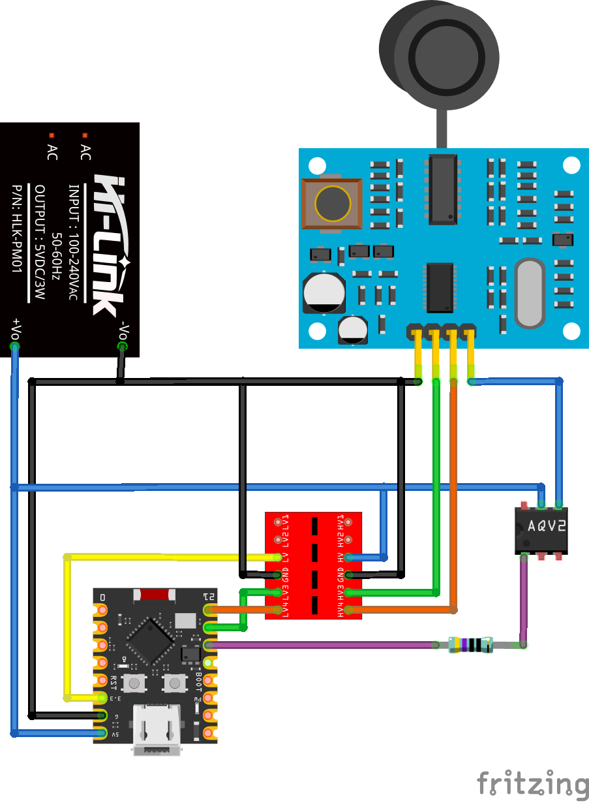

# Wiring — UART (Mode 2 with 120kΩ on R27)

**Bidirectional UART:** sensor **TX → ESP RX** and **ESP TX → sensor RX**. **Solder a 120kΩ resistor on pad R27** to enable UART **Mode 2**. Consult your module’s silkscreen (often labeled **R27 / MODE / M1**).

**Recommended pins**

* Sensor **TX** → **ESP RX (GPIO20)** via level shifter
* ESP **TX (GPIO21)** → **Sensor RX** via level shifter
* Power & ground: **VCC → 5V/VBUS**, **GND → GND**

**Connections**

* JSN‑SR04T **VCC** → **SSR Output** → ESP **5V/VBUS**
* JSN‑SR04T **GND** → ESP **GND**  
* JSN‑SR04T **TX** → (HV) **Level Shifter HV1** → **LV1** → **GPIO20 (RX)**
* JSN‑SR04T **RX** ← (HV) **Level Shifter HV2** ← **LV2** ← **GPIO21 (TX)**
* **AQV258 LED+** ← **GPIO10** (via 470kΩ resistor)
* **AQV258 LED-** ← ESP **GND**
* **AQV258 Input** ← ESP **5V/VBUS**

> **Tip:** Keep cable from control board to transducer head short to minimize noise. Mount sensor head facing straight down for level sensing.

**Wiring Diagram**

## AQV258 PhotoMOS Power Control Integration

**AQV258 PhotoMOS Requirements:**
- Input: Low current LED drive (3.3V compatible)
- Output: Rated for JSN-SR04T (5V, <50mA)
- Normally open contacts
- Optical isolation between control and power circuits

**Additional Components:**
- **470kΩ current limiting resistor** between GPIO10 and AQV258 LED input
- No pull-up resistor needed (PhotoMOS has defined OFF state)

**Power Control Sequence:**
1. GPIO10 goes HIGH → AQV258 LED turns ON → JSN-SR04T powered
2. 2-second stabilization delay
3. 3 burst readings with 2s intervals
4. GPIO10 goes LOW → AQV258 LED turns OFF → JSN-SR04T unpowered
